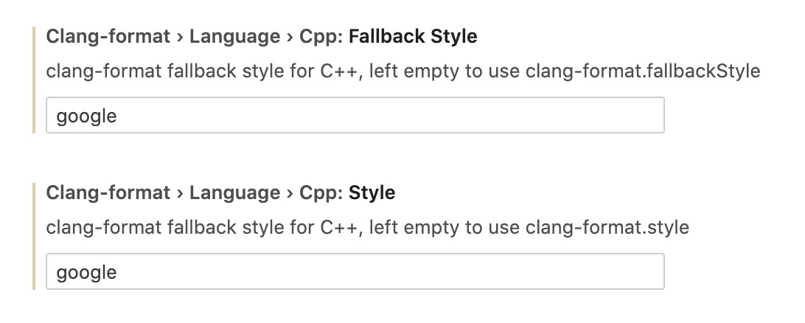

## GUIDE

1. INSTALL (VSCODE)

Install Clang-Format from vscode extension(xaver.clang-format).

2. SETTING

Just type goole to cpp style

3. USE

Files can be formatted on-demand by right clicking in the document and selecting "Format Document", or by using the associated keyboard shortcut (usually Ctrl+⇧+F on Windows, Ctrl+⇧+I on Linux, and ⇧+⌥+F on macOS).

## P.S.

To automatically format a file on save, add the following to your vscode settings.json file:

{
    "editor.formatOnSave": true
}
